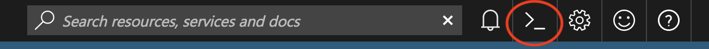
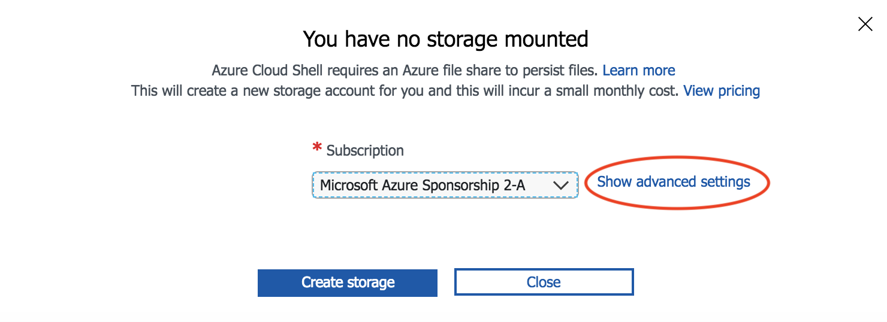
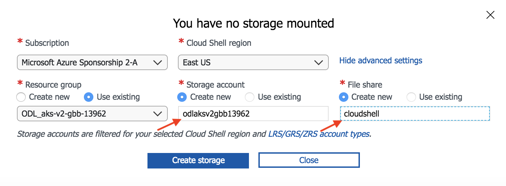

# Lab Environment

## Classroom Setting

These labs are designed for delivery in a classroom setting with the **Azure Global Blackbelt Team.** 

### Setup Environment

* Setup Azure Cloud Shell: 

    1. Browse to http://portal.azure.com
    2. Login with the Azure credentials that were created in the previous steps (eg - "odl_user_12345@gbbossteamoutlook.onmicrosoft.com")
    3. Click on the cloud shell icon to start your session.

        

    4. Select `Bash (Linux)`
    5. You will be prompted to setup storage for your cloud shell. Click `Show advanced settings`

        

    6. Provide a unique value for Storage account name. This must be all lower case and no punctuation. Use "cloudshell" for File share name. See example below.

        

    7. Click `Create storage`

    > Note: You can also use the dedicated Azure Cloud Shell URL: http://shell.azure.com 

